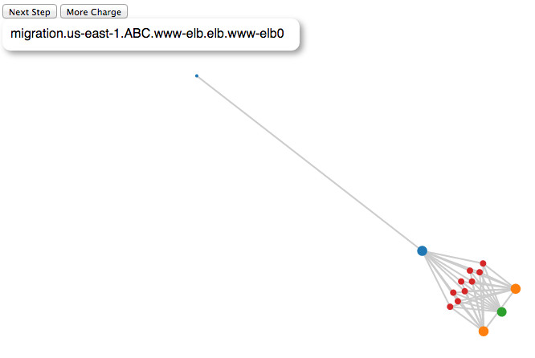
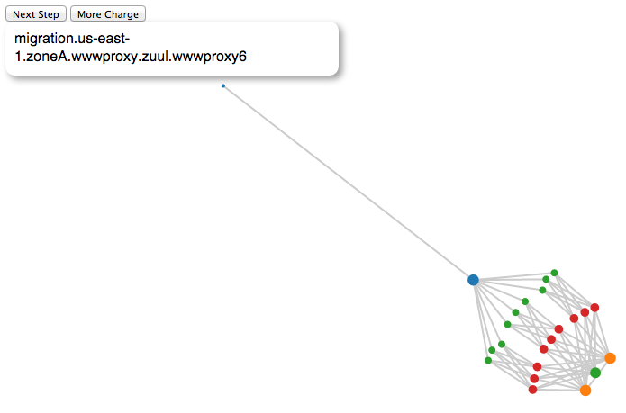
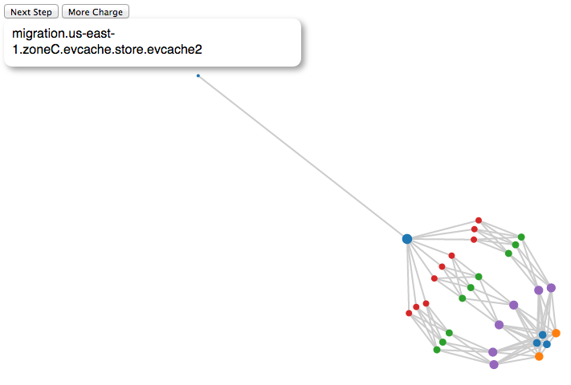
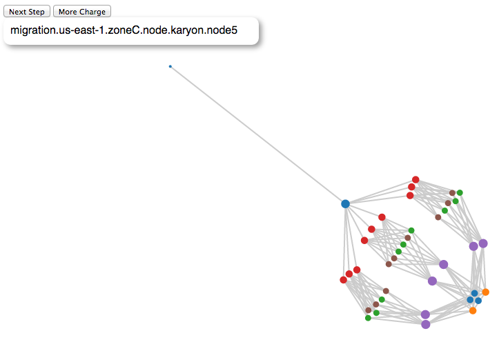
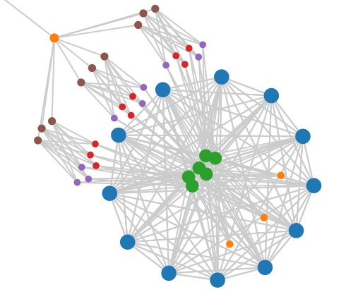
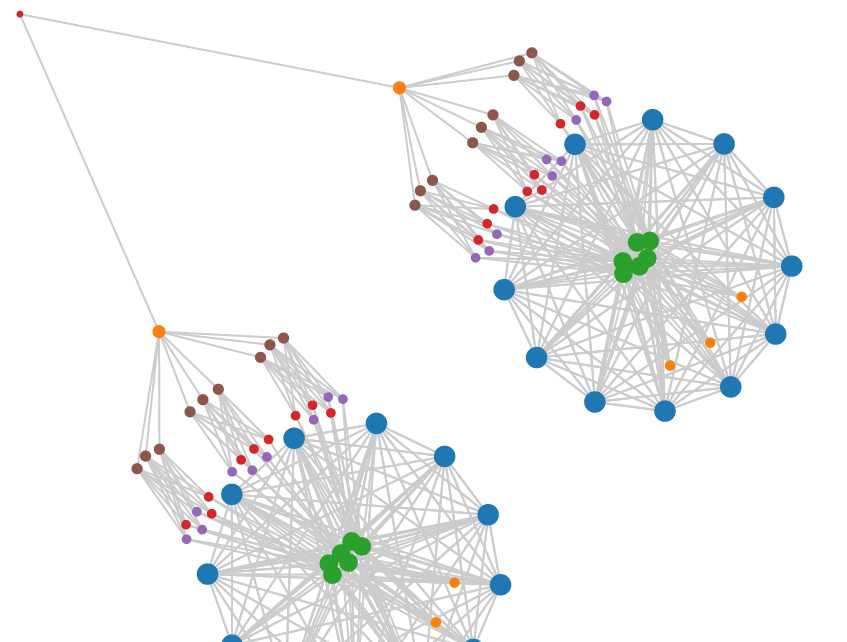
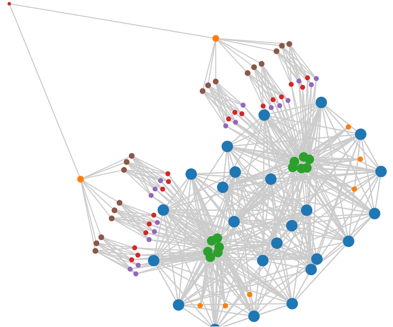
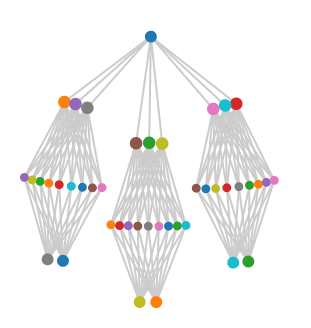
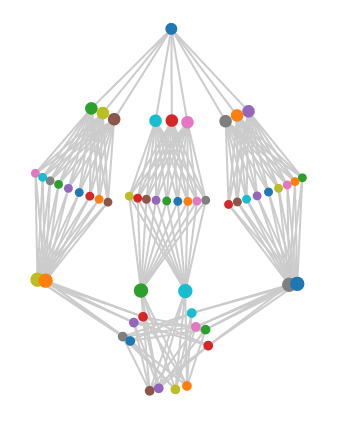
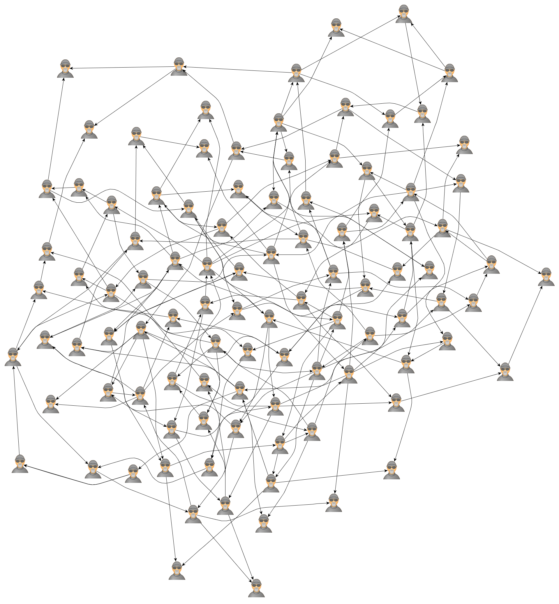

spigo
=====

Simulate Protocol Interactions in Go using nanoservice actors

Suitable for fairly large scale simulations, runs well up to 100,000 independent nanoservice actors. Three architectures are implemented. One creates a peer to peer social network (fsm and pirates). The others are based on a LAMP stack or NetflixOSS microservices in a more tree structured model. The migration architecture starts with LAMP and ends with NetflixOSS.

Each nanoservice actor is a goroutine. to create 100,000 pirates, deliver 700,000 messages and wait to shut them all down again takes about 4 seconds. The resulting graph can be visualized via GraphML or rendered by saving to Graph JSON and viewing in a web browser via D3.

A few lines of code can be used to create an interesting architecture. The code is still being cleaned up and refactored, but if you figure out your own architecture in this form it's going to be easy to carry forward as Spigo evolves.

Presentation at the O'Reilly Software Architecture Conference: Monitoring Microservices - A Challenge
http://www.slideshare.net/adriancockcroft/software-architecture-monitoring-microservices-a-challenge

```
                Create(cname, "priamCassandra", archaius.Conf.Regions, priamCassandracount, cname)
                Create(sname, "store", archaius.Conf.Regions, mysqlcount, sname)
                Create(mname, "store", archaius.Conf.Regions, mcount)
                Create(tname, "staash", archaius.Conf.Regions, staashcount, sname, mname, cname)
                Create(pname, "karyon", archaius.Conf.Regions, phpcount, tname)
                Create(nname, "karyon", archaius.Conf.Regions, nodecount, tname)
                Create(zuname, "zuul", archaius.Conf.Regions, zuulcount, pname, nname)
                Create(elbname, "elb", archaius.Conf.Regions, 0, zuname)
```

[](https://godoc.org/github.com/adrianco/spigo)


```
$ ./spigo -h
Usage of ./spigo:
  -a="netflixoss": Architecture to create or read, fsm, lamp, migration, or netflixoss
  -c=false: Collect metrics to <arch>_metrics.json and via http:
  -cpuprofile="": Write cpu profile to file
  -d=10:    Simulation duration in seconds
  -g=false: Enable GraphML logging of nodes and edges to <arch>.graphml
  -j=false: Enable GraphJSON logging of nodes and edges to <arch>.json
  -m=false: Enable console logging of every message
  -p=100:   Pirate population for fsm or scale factor % for netflixoss etc.
  -r=false: Reload <arch>.json to setup architecture
  -s=0:     Stop creating microservices at this step, 0 = don't stop
  -u="1s":     Polling interval for Eureka name service
  -w=1:     Wide area regions
  
$ ./spigo -a migration -d 2 -j
2015/03/18 08:35:31 migration: scaling to 100%
2015/03/18 08:35:31 Create service: eureka
2015/03/18 08:35:31 Eureka cross connect from: migration.us-east-1.zoneA.eureka.eureka.eureka0 to migration.us-east-1.zoneB.eureka.eureka.eureka1
2015/03/18 08:35:31 Eureka cross connect from: migration.us-east-1.zoneA.eureka.eureka.eureka0 to migration.us-east-1.zoneC.eureka.eureka.eureka2
2015/03/18 08:35:31 Eureka cross connect from: migration.us-east-1.zoneB.eureka.eureka.eureka1 to migration.us-east-1.zoneA.eureka.eureka.eureka0
2015/03/18 08:35:31 Eureka cross connect from: migration.us-east-1.zoneB.eureka.eureka.eureka1 to migration.us-east-1.zoneC.eureka.eureka.eureka2
2015/03/18 08:35:31 Eureka cross connect from: migration.us-east-1.zoneC.eureka.eureka.eureka2 to migration.us-east-1.zoneA.eureka.eureka.eureka0
2015/03/18 08:35:31 Eureka cross connect from: migration.us-east-1.zoneC.eureka.eureka.eureka2 to migration.us-east-1.zoneB.eureka.eureka.eureka1
2015/03/18 08:35:31 Create service: cassTurtle
2015/03/18 08:35:31 migration.edda: starting
2015/03/18 08:35:31 migration.us-east-1.zoneA.eureka.eureka.eureka0: starting
2015/03/18 08:35:31 migration.us-east-1.zoneB.eureka.eureka.eureka1: starting
2015/03/18 08:35:31 migration.us-east-1.zoneC.eureka.eureka.eureka2: starting
2015/03/18 08:35:31 Create service: memcache
2015/03/18 08:35:31 Create service: turtle
2015/03/18 08:35:31 Create service: php
2015/03/18 08:35:31 Create service: node
2015/03/18 08:35:31 Create service: wwwproxy
2015/03/18 08:35:31 Create cross zone: www-elb
2015/03/18 08:35:31 Create cross region: www
2015/03/18 08:35:31 migration: denominator activity rate  10ms
2015/03/18 08:35:33 migration: Shutdown
2015/03/18 08:35:33 migration.us-east-1.zoneB.eureka.eureka.eureka1: closing
2015/03/18 08:35:33 migration.us-east-1.zoneC.eureka.eureka.eureka2: closing
2015/03/18 08:35:33 migration.us-east-1.zoneA.eureka.eureka.eureka0: closing
2015/03/18 08:35:33 migration: Exit
2015/03/18 08:35:33 spigo: migration complete
2015/03/18 08:35:33 migration.edda: closing

$ ./spigo -a netflixoss -d 1 -j -c
2015/02/20 09:44:25 netflixoss: scaling to 100%
2015/02/20 09:44:25 HTTP metrics now available at localhost:8123/debug/vars
2015/02/20 09:44:25 netflixoss.edda: starting
2015/02/20 09:44:25 netflixoss.eureka: starting
2015/02/20 09:44:25 netflixoss: denominator activity rate  10ms
2015/02/20 09:44:26 netflixoss: Shutdown
2015/02/20 09:44:26 netflixoss.eureka: closing
2015/02/20 09:44:27 netflixoss: Exit
2015/02/20 09:44:27 spigo: netflixoss complete
2015/02/20 09:44:27 netflixoss.edda: closing

$ ./spigo -d 1 -j -c
2015/02/20 09:45:25 fsm: population 100 pirates
2015/02/20 09:45:25 HTTP metrics now available at localhost:8123/debug/vars
2015/02/20 09:45:25 fsm.edda: starting
2015/02/20 09:45:25 fsm: Talk amongst yourselves for 1s
2015/02/20 09:45:25 fsm: Delivered 600 messages in 125.328265ms
2015/02/20 09:45:26 fsm: Shutdown
2015/02/20 09:45:26 fsm: Exit
2015/02/20 09:45:26 spigo: fsm complete
2015/02/20 09:45:26 fsm.edda: closing

$ ./spigo -a netflixoss -d 2 -r
2015/02/20 09:48:22 netflixoss reloading from netflixoss.json
2015/02/20 09:48:22 Version:  spigo-0.3
2015/02/20 09:48:22 Architecture:  netflixoss
2015/02/20 09:48:22 netflixoss.eureka: starting
2015/02/20 09:48:22 Link netflixoss.global-api-dns > netflixoss.us-east-1-elb
2015/02/20 09:48:22 Link netflixoss.us-east-1-elb > netflixoss.us-east-1.zoneA.zuul0
...
2015/02/20 09:48:22 Link netflixoss.us-east-1-elb > netflixoss.us-east-1.zoneC.zuul8
2015/02/20 09:48:22 Link netflixoss.us-east-1.zoneA.zuul0 > netflixoss.us-east-1.zoneA.karyon0
...
2015/02/20 09:48:22 Link netflixoss.us-east-1.zoneC.zuul8 > netflixoss.us-east-1.zoneC.karyon26
2015/02/20 09:48:22 Link netflixoss.us-east-1.zoneA.karyon0 > netflixoss.us-east-1.zoneA.staash0
...
2015/02/20 09:48:22 Link netflixoss.us-east-1.zoneC.karyon26 > netflixoss.us-east-1.zoneC.staash5
2015/02/20 09:48:22 Link netflixoss.us-east-1.zoneA.staash0 > netflixoss.us-east-1.zoneA.priamCassandra0
...
2015/02/20 09:48:22 Link netflixoss.us-east-1.zoneC.staash5 > netflixoss.us-east-1.zoneC.priamCassandra11
2015/02/20 09:48:22 Link netflixoss.us-east-1.zoneA.priamCassandra0 > netflixoss.us-east-1.zoneB.priamCassandra1
...
2015/02/20 09:48:22 Link netflixoss.us-east-1.zoneC.priamCassandra11 > netflixoss.us-east-1.zoneB.priamCassandra1
2015/02/20 09:48:24 netflixoss: Shutdown
2015/02/20 09:48:24 netflixoss.eureka: closing
2015/02/20 09:48:24 netflixoss: Exit
2015/02/20 09:48:24 spigo: netflixoss complete
```

Migration from LAMP to NetflixOSS
-----------
The orchestration to create this now uses a eureka discovery service per zone and has been heavily refactored.
[Run this in your browser by clicking here](http://rawgit.com/adrianco/spigo/master/migration.html?1)

Start with a monolithic LAMP stack


Interpose Zuul proxy between load balancer and PHP monolith services


Replace single memcached with cross zone EVcache replicated memcached and change PHP to access MySQL via Staash (Storage Tier as a Service HTTP)


Add some Node based microservices between Zuul and Staash alongside PHP


Start a Cassandra cluster and connect to Staash alongside MySQL and evcache for data and access migration


Remove MySQL for gradual data migration/duplication


Add a second region without connecting up cassandra


Connect regions together using multi-region Cassandra


LAMP Stack Architecture
-----------
To create a starting point for architecture transitions, an AWS hosted LAMP stack is simulated. It has DNS feeding an ELB, then a horizontally scaled layer of PHP servers backed with a single memcached and a master slave pair of MySQL servers. The configuration is managed using a Eureka name service and logged by Edda. [Run this in your browser by clicking here](http://rawgit.com/adrianco/spigo/master/lamp.html)


NetflixOSS Architecture
-----------
Simple simulations of the following AWS and NetflixOSS services are implemented. Edda collects the configuration and writes it to Json or Graphml. Eureka implements a service registry. Archaius contains global configuration data. Denominator simulates a global DNS endpoint. ELB generates traffic that is split across three availability zones. Zuul takes requests and routes it to the Karyon business logic layer. Karyon calls into the Staash data access layer, which calls PriamCassandra, which provides cross zone and cross region connections.

Each microservice is based on Karyon as the prototype to copy when creating a new microservice. The simulation passes get and put requests down the tree one at a time from Denominator. Get requests lookup the key in PriamCassandra and respond back up the tree. Put requests go down the tree only, and PriamCassandra replicates the put across all zones and regions.

Scaled to 200% with one ELB in the center, three zones with six Zuul and 18 Karyon each zone, rendered using GraphJSON and D3.


Scaled 100% With one ELB at the top, three zones with three Zuul, nine Karyon and two staash in each zone, rendered using GraphJSON and D3.



Scaled 100% With one ELB at the top, three zones with three Zuul, nine Karyon, two Staash and four Priam-Cassandra in each zone, rendered using GraphJSON and D3.



Scaled 100% with Denominator connected to an ELB in two different regions, and cross region Priam-Cassandra connections, showing a tooltip and the charge increase option.
[Run this in your browser by clicking here](http://rawgit.com/adrianco/spigo/master/netflixoss.html)


With the -m option all messages are logged as they are received. The time taken to deliver the message is shown
```
2015/03/01 13:16:09 netflixoss.us-east-1.ABC.api-elb.elb.api-elb0: gotocol: 18.9us Put remember me
2015/03/01 13:16:09 netflixoss.us-east-1.zoneC.apiproxy.zuul.apiproxy2: gotocol: 6.726us Put remember me
2015/03/01 13:16:09 netflixoss.us-east-1.zoneC.api.karyon.api23: gotocol: 6.002us Put remember me
2015/03/01 13:16:09 netflixoss.us-east-1.zoneC.turtle.staash.turtle2: gotocol: 5.891us Put remember me
2015/03/01 13:16:09 netflixoss.us-east-1.zoneC.cassTurtle.priamCassandra.cassTurtle11: gotocol: 5.798us Put remember me
2015/03/01 13:16:09 netflixoss.us-east-1.zoneA.cassTurtle.priamCassandra.cassTurtle0: gotocol: 8.393us Replicate remember me
2015/03/01 13:16:09 netflixoss.us-east-1.zoneB.cassTurtle.priamCassandra.cassTurtle1: gotocol: 30.158us Replicate remember me
2015/03/01 13:16:09 netflixoss.us-east-1.ABC.api-elb.elb.api-elb0: gotocol: 48.584us GetRequest why?
2015/03/01 13:16:09 netflixoss.us-east-1.zoneA.apiproxy.zuul.apiproxy3: gotocol: 13.474us GetRequest why?
2015/03/01 13:16:09 netflixoss.us-east-1.zoneA.api.karyon.api9: gotocol: 6.496us GetRequest why?
2015/03/01 13:16:09 netflixoss.us-east-1.zoneA.turtle.staash.turtle3: gotocol: 3.897us GetRequest why?
2015/03/01 13:16:09 netflixoss.us-east-1.zoneA.cassTurtle.priamCassandra.cassTurtle9: gotocol: 6.129us GetRequest why?
2015/03/01 13:16:09 netflixoss.us-east-1.zoneA.turtle.staash.turtle3: gotocol: 2.869us GetResponse because...
2015/03/01 13:16:09 netflixoss.us-east-1.zoneA.api.karyon.api9: gotocol: 2.169us GetResponse because...
2015/03/01 13:16:09 netflixoss.us-east-1.zoneA.apiproxy.zuul.apiproxy3: gotocol: 3.806us GetResponse because...
2015/03/01 13:16:09 netflixoss.us-east-1.ABC.api-elb.elb.api-elb0: gotocol: 2.272us GetResponse because...
2015/03/01 13:16:09 netflixoss.*.*.global-api-dns.denominator.global-api-dns0: gotocol: 2.422us GetResponse because...
```

100 Pirates 
-----------
After seeding with two random friends GraphML rendered using yFiles


After chatting and making new friends rendered using graphJSON and D3


[Run spigo.html in your browser by clicking here](http://rawgit.com/adrianco/spigo/master/spigo.html)

Spigo uses a common message protocol called Gotocol which contains a channel of the same type. This allows message listener endpoints to be passed around to dynamically create an arbitrary interconnection network.

Using terminology from Promise Theory each message also has an Imposition code that tells the receiver how to interpret it, and an Intention body string that can be used as a simple string, or to encode a more complex structured type or a Promise.

There is a central controller, the FSM (Flexible Simulation Manager or [Flying Spaghetti Monster](http://www.venganza.org/about/)), and a number of independent Pirates who listen to the FSM and to each other.

Current implementation creates the FSM and a default of 100 pirates, which can be set on the command line with -p=100. The FSM sends a Hello PirateNN message to name them which includes the FSM listener channel for back-chat. FSM then iterates through the pirates, telling each of them about two of their buddies at random to seed the network, giving them a random initial amount of gold coins, and telling them to start chatting to each other at a random pirate specific interval of between 0.1 and 10 seconds.

FSM can also reload from a json file that describes the nodes and edges in the network.

Either way FSM sleeps for a number of seconds then sends a Goodbye message to each. The Pirate responds to messages until it's told to chat, then it also wakes up at intervals and either tells one of its buddies about another one, or passes some of it's gold to a buddy until it gets a Goodbye message, then it quits and confirms by sending a Goodbye message back to the FSM. FSM counts down until all the Pirates have quit then exits.

The effect is that a complex randomized social graph is generated, with density increasing over time. This can then be used to experiment with trading, gossip and viral algorithms, and individual Pirates can make and break promises to introduce failure modes. Each pirate gets a random number of gold coins to start with, and can send them to buddies, and remember which benefactor buddy gave them how much.

Simulation is logged to a file spigo.graphml with the -g command line option or <arch>.json with the -j option. Inform messages are sent to a logger service from the pirates, which serializes writes to the file. The graphml format includes XML gibberish header followed by definitions of the node names and the edges that have formed between them. Graphml can be visualized using the yEd tool from yFiles. The graphJSON format is simpler and Javascript code to render it using D3 is in spigo.html.

There is a test program that exercises the Namedrop message, this is where the FSM or a Pirate passes on the name of a third party, and each Pirate builds up a buddy list of names and the listener channel for each buddy. Another test program tests the type conversions for JSON readings and writing.

The basic framework is in place, but more interesting behaviors, automonous running, and user input to control or stop the simulation haven't been added yet. [See the pdf for some Occam code](SkypeSim07.pdf) and results for the original version of this circa 2007.

Next steps include connecting the output directly to the browser over a websocket so the dynamic behavior of the graph can be seen in real time. A lot of refactoring has cleaned up the code and structure in preparation for more interesting features.

Jason Brown's list of interesting Gossip papers might contain something interesting to try and implement... http://softwarecarnival.blogspot.com/2014/07/gossip-papers.html

Benchmark result
================
At one point during setup FSM delivers five messages to each Pirate in turn, and the message delivery rate for that loop is measured at about 270,000 msg/sec. There are two additional shutdown messages per pirate in each run, plus whatever chatting occurs.
```
$ time spigo -d=0 -p=100000
2015/01/23 17:31:04 Spigo: population 100000 pirates
2015/01/23 17:31:05 fsm: Hello
2015/01/23 17:31:06 fsm: Talk amongst yourselves for 0
2015/01/23 17:31:07 fsm: Delivered 500000 messages in 1.865390635s
2015/01/23 17:31:07 fsm: Go away
2015/01/23 17:31:08 fsm: Exit
2015/01/23 17:31:08 spigo: fsm complete

real	0m3.968s
user	0m2.982s
sys	0m0.981s
```

Up to about 200,000 pirates time is linear with count. Beyond that it gradually slows down as my laptop runs out of memory.

